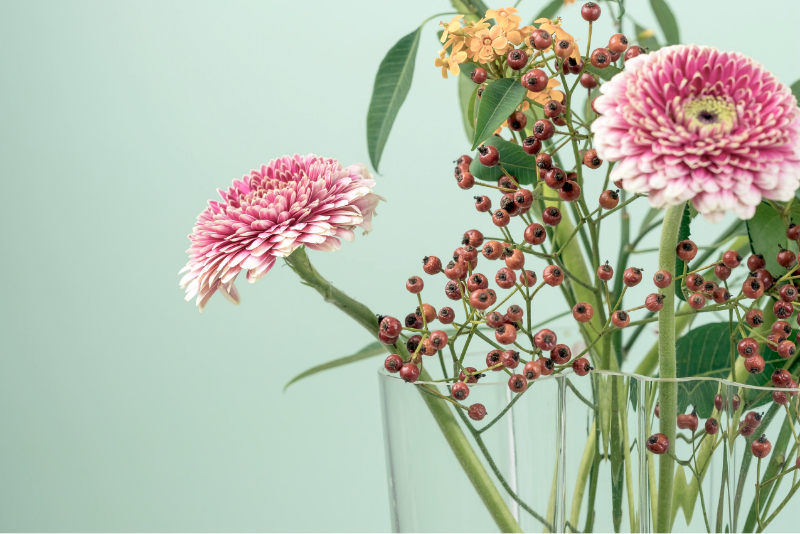
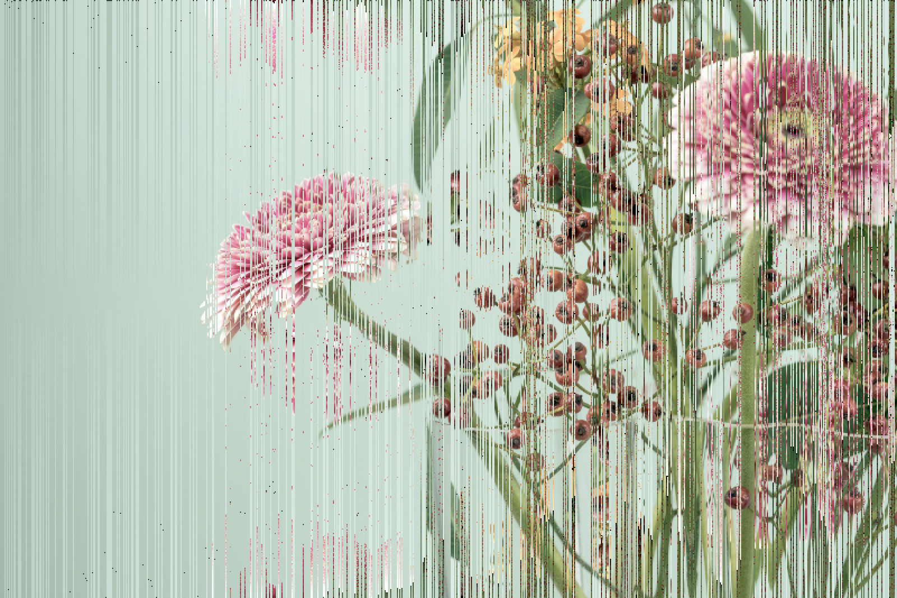
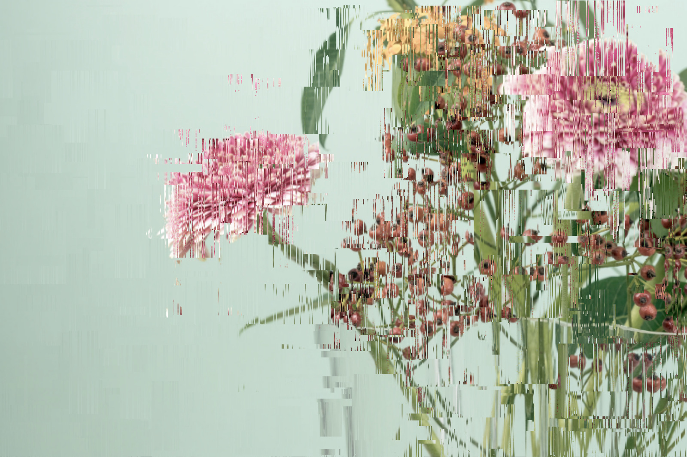

# p5-glitch-effects
Research on glitch effects in the context of a p5 sketch 

## BASIC Just render the input image https://unsplash.com/photos/YDNvydD1jAY


```javascript
// A variable to store image data
let img;

// Load the image data into the variable
function preload() {
  img = loadImage('flowers.png');
}

// Use the image data
function setup() {
  // Same size as the image
  createCanvas(800, 533);
  
  // Render the image data with p5's image()
  // https://p5js.org/reference/#/p5/image
  image(img, 0, 0);
}
```

## INTERMEDIATE Render multiple images on top of each other


```javascript
// A variable to store image data
let img;

// Load the image data into the variable
function preload() {
  img = loadImage('flowers.png');
}

// Use the image data
function setup() {
  // Same size as the image
  createCanvas(800, 533);
  
  // Render the image
  image(img, 0, 0);
  
  // Render 5000 smaller sections of the image with a random offset on top
  for (let t = 5000; t > 0; t -= 1) {
    // Random position
    const x = random(width);
    const y = random(height);
    
    // Random x offset
    const ox = random(-20, 20);
    
    // Random scaled region
    const w = floor(random(1, 100));
    const h = floor(random(1, 100));
    
    // Get the pixel data
    const g = img.get(x, y, w, h);
    
    // Render the results
    image(g, x + ox, y);
  }
}
```

## ADVANCED Read the colors per row and apply sorting effects


```javascript
// A variable to store image data
let img; 

// Load the image data into the variable
function preload() {
  img = loadImage('flowers.png');
}

// Use the image data
function setup() {
  // Same size as the image
  createCanvas(800, 533);
  
  // For all rows
  for (let x = 0; x < width; x += 1) {
    // Get all colors from top to bottom in a list
    const colors = [];
    for (let y = 0; y < img.height; y += 1) {
      const col = img.get(x, y);
      colors.push(col);
    }
    
    // Effect
    // Randomly eiter do nothing, sort, reverse or sort, then reverse
    if (random(0, 1) > 0.5) {
      if (random(0, 1) > 0.5) colors.sort();
      if (random(0, 1) > 0.5) colors.reverse();
    }
    
    // Render the results
    for (let y = 0; y < height; y += 1) {
      stroke(colors[y]);
      point(x, y);
    }
  }
}
```

## YETIADVANCED Refactor to a function and combine all of the above


```javascript
// A variable to store image data
let img;

// A function that returns an image with the effects appplied
function effect(buffer) {
  // The graphic to be returned is the same size as the image (buffer)
  const gfx = createGraphics(buffer.width, buffer.height);
  
  // Tell p5 that we will manipulate the pixels
  gfx.loadPixels();
  
  // For all rows
  for (let x = 0; x < gfx.width; x += 1) {
    // Get all colors from top to bottom in a list
    const colors = [];
    for (let y = 0; y < buffer.height; y += 1) {
      colors.push(buffer.get(x, y));
    }
    
    // Effect
    // Randomly eiter do nothing, sort, reverse or sort, then reverse
    if (random(0, 1) > 0.5) {
      if (random(0, 1) > 0.5) { colors.sort(); }
      if (random(0, 1) > 0.5) { colors.reverse(); }
    }
    
    // Render the results
    for (let y = 0; y < gfx.height; y += 1) {
      gfx.set(x, y, colors[y]);
    }
  }
  // Tell p5 that we finished pixel manipulation 
  gfx.updatePixels();
  
  // Done
  return gfx;
}

// Load the image data into the variable
function preload() {
  img = loadImage(name + ext);
}

// Use the image data
function setup() {
  // Same size as the image
  createCanvas(800, 533);
  
  // Render the image
  image(img, 0, 0);
  
   // Render smaller sections of the image with a random offset on top
  for (let t = 0; t < 550; t += 1) {
    // Random position 
    const x = random(width);
    const y = random(height);
    
    // Random offset x 
    const ox = random(-20, 20);
    
    // Random area
    const w = floor(random(1, 100));
    const h = floor(random(1, 100));
    
    // Get the image data
    const g = img.get(x, y, w, h);
    
    // Render the image data with chained effect 
    image(effect(g), x + ox, y);
  }
}
```
